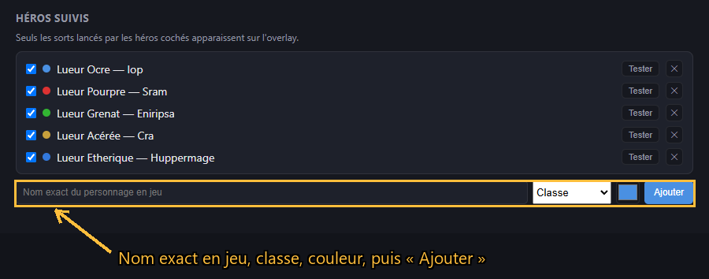
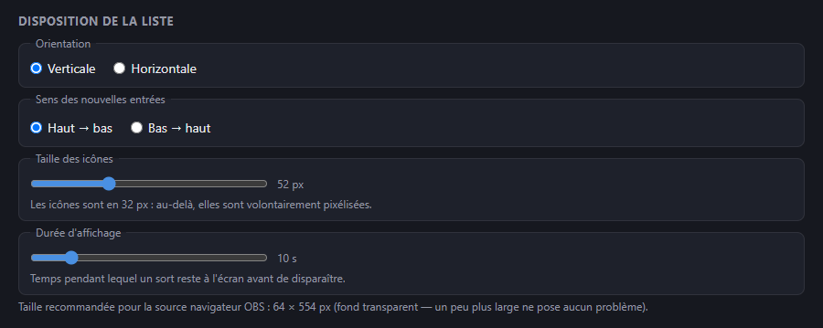
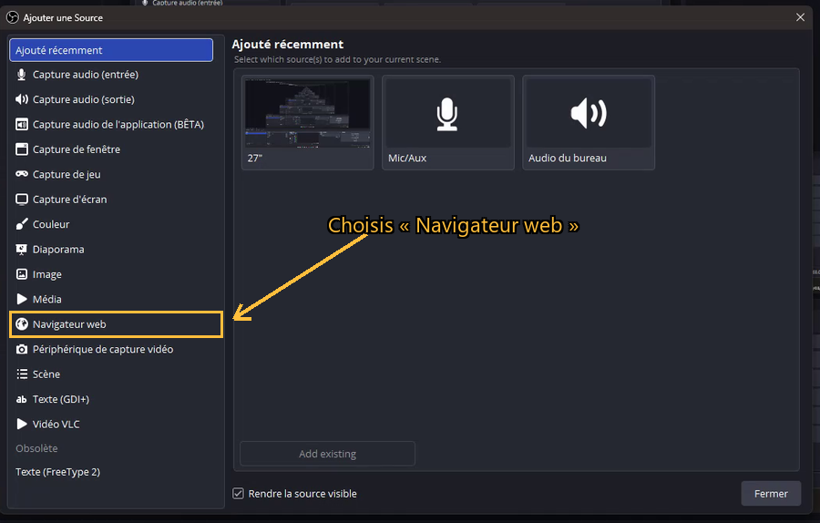
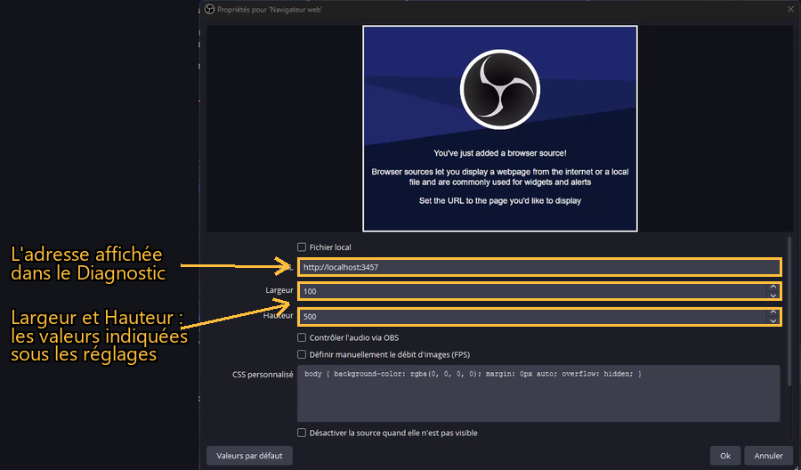
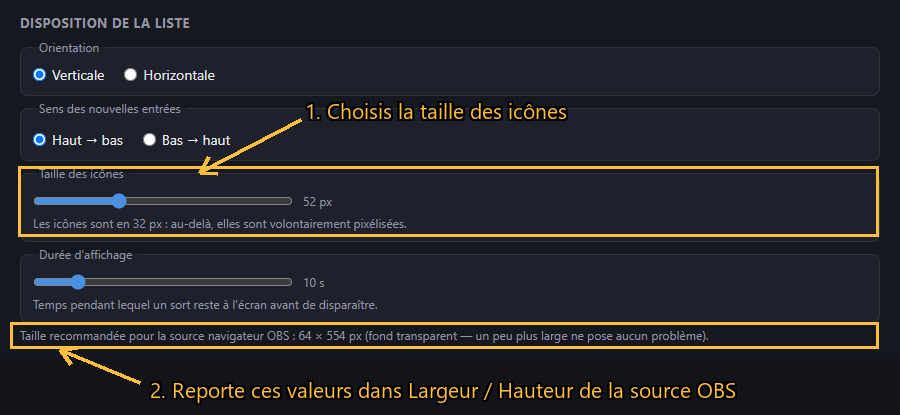
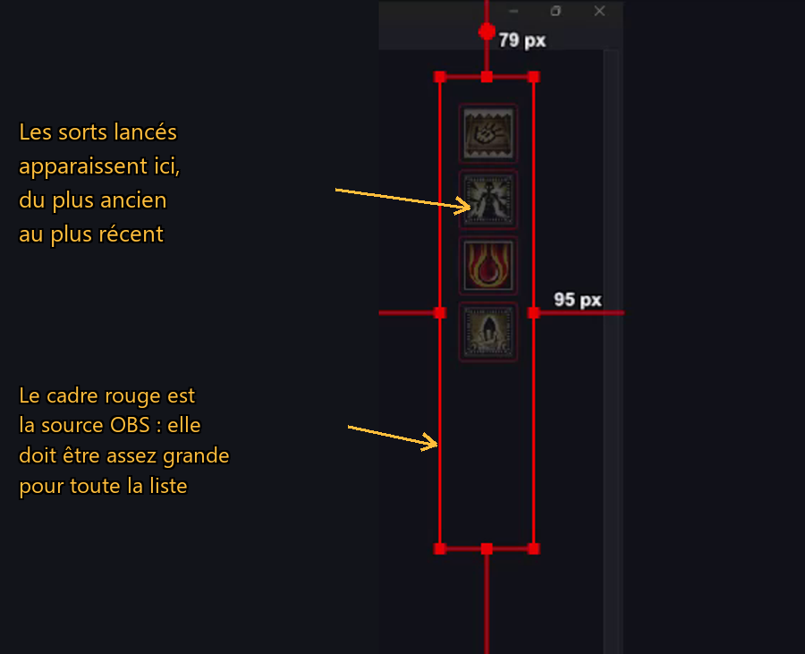
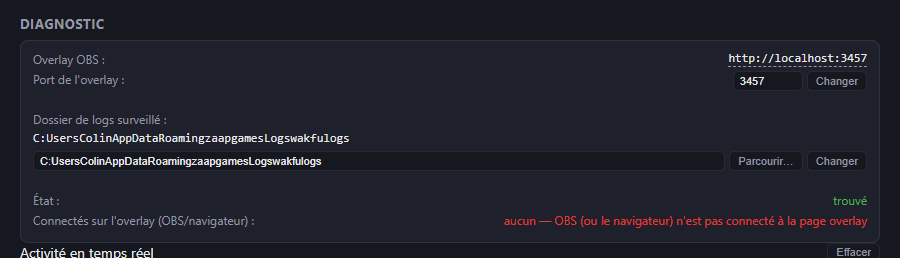
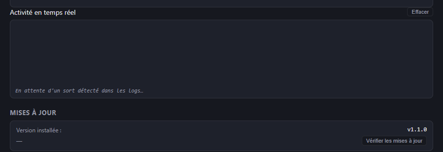

# Wakfu Combo Overlay

[](https://github.com/utruna/wakfu-combo-overlay/releases)
[](https://github.com/utruna/wakfu-combo-overlay/releases/latest)

Application de bureau autonome (Electron) qui lit les logs de combat Wakfu en temps réel et affiche les sorts lancés par tes personnages sur un overlay OBS, sous forme d'icônes qui défilent.

---

## Ce que ça fait

1. Surveille `wakfu.log` (le fichier de logs du client Wakfu) et détecte chaque ligne `[Information (combat)] <Personnage> lance le sort <Sort>`.
2. Ne garde que les sorts lancés par les personnages que tu as explicitement ajoutés et cochés — tout le reste (autres joueurs, mobs) est ignoré automatiquement, puisque le log donne directement le nom du lanceur.
3. Diffuse ces sorts (avec leur icône) vers une page web locale, à ajouter comme **Source Navigateur** dans OBS.
4. Une fenêtre de réglages (accessible depuis l'icône dans le tray Windows) permet de gérer tout ça sans toucher à un fichier de config à la main.

---

## Prérequis

- Node.js 18+
- Windows (le chemin des logs Wakfu et le mécanisme de veille de fichiers sont spécifiques à Windows)
- Wakfu installé via le launcher Zaap

---

## Lancer en développement

```bash
npm install
npm run electron:dev
```

Une icône apparaît dans le tray Windows (souvent rangée dans la zone des icônes cachées, la flèche `^` à côté de l'horloge) et la fenêtre de réglages s'ouvre automatiquement au premier lancement.

## Générer un exécutable

```bash
npm run dist
```

Produit un installeur Windows (NSIS) dans `dist/`.

### Publier une release sur GitHub

Le workflow `.github/workflows/release.yml` build l'installeur sur un runner Windows et le publie directement en **GitHub Release** — pas besoin de commit l'exe dans le dépôt.

1. Monte la version dans `package.json` (`npm version patch` / `minor` / `major`, ou modifie le champ `version` à la main) et pousse le commit.
2. Sur GitHub : onglet **Actions** → workflow **Build & Release (Windows)** → **Run workflow**.
3. Une fois terminé, la release `vX.Y.Z` apparaît dans l'onglet **Releases** avec l'installeur `.exe` et le fichier `latest.yml` en pièces jointes.

Le tag et le nom de la release sont dérivés automatiquement de `package.json`. Le workflow vérifie qu'une release pour cette version n'existe pas déjà (via `gh release view`) et **échoue explicitement** si c'est le cas, plutôt que de créer un doublon — relance-le après avoir bumpé `version` si ça arrive. Il crée aussi et pousse le tag git `vX.Y.Z` correspondant avant de builder : `build.publish.releaseType: "release"` (voir plus bas) fait publier la release directement par electron-builder plutôt qu'en brouillon, et GitHub refuse de publier une release dont le tag n'existe pas encore dans le dépôt.

`latest.yml` est le fichier que lit l'auto-updater pour connaître la dernière version — une release sans lui casse la vérification de mise à jour côté client (voir Dépannage).

---

## Guide d'installation

### 1. Installer l'application

Télécharge le fichier `Wakfu-Combo-Overlay-Setup-X.Y.Z.exe` depuis la [dernière release](https://github.com/utruna/wakfu-combo-overlay/releases/latest) et lance-le.

Windows SmartScreen peut afficher un avertissement (l'installeur n'est pas signé numériquement) : **Informations complémentaires** → **Exécuter quand même**.

Au premier lancement, la fenêtre de réglages s'ouvre automatiquement. L'appli vit ensuite dans le **tray Windows** — souvent rangée derrière la flèche `^` à côté de l'horloge.

### 2. Ajouter tes personnages



Pour chaque personnage à afficher :

1. Saisis son **nom exact en jeu** (c'est la clé utilisée pour le reconnaître dans les logs — une faute et il ne sera jamais détecté).
2. Choisis sa **classe** : elle départage les sorts portant le même nom chez plusieurs classes (ex. « Rafale » chez Iop et chez Cra).
3. Choisis une **couleur** : c'est celle de la bordure autour de ses icônes.
4. **Ajouter**.

Les cases à cocher activent/désactivent chaque personnage sans le supprimer. Le bouton **Tester** envoie un faux sort à l'overlay — pratique pour vérifier l'affichage sans lancer de combat. Tout est enregistré immédiatement, il n'y a pas de bouton « Enregistrer ».

### 3. Régler l'affichage



**Attention à la taille des icônes** : c'est le piège le plus courant. Plus les icônes sont grandes, plus la liste est longue — et si elle dépasse la source navigateur OBS, les sorts s'affichent hors du cadre visible. La ligne sous les réglages indique en direct la taille à donner à la source :

| Taille icône | Source OBS verticale | Source OBS horizontale | Icônes visibles dans 600 px de haut |
|---|---|---|---|
| 32 px | 44 × 394 px | 394 × 44 px | 8 |
| 48 px | 60 × 522 px | 522 × 60 px | 8 |
| 64 px | 76 × 650 px | 650 × 76 px | 6 |
| 96 px | 108 × 906 px | 906 × 108 px | 4 |
| 128 px | 140 × 1162 px | 1162 × 140 px | 3 |

Le nombre max de sorts visibles est configurable dans les réglages (entier, min/max). Si la limite est atteinte, le plus ancien est retiré et les plus récents restent affichés. Si la source est trop petite, l'overlay garde ce qui tient réellement à l'écran, toujours en priorisant les plus récents.

### 4. Configurer OBS



Dans la liste **Sources** de ta scène : **+** → **Navigateur**.



Dans les propriétés de la source :

- **Fichier local** (recommandé) : coche la case et choisis `overlay-obs.html`, dont le chemin est affiché dans le panneau Diagnostic (un clic dessus le copie). L'overlay s'affiche alors même si OBS est lancé avant l'appli.
- Ou **URL** : `http://localhost:3457` (l'adresse exacte est affichée dans le panneau Diagnostic, un clic dessus la copie). Dans ce cas, l'appli doit être lancée avant OBS, sinon la source reste vide jusqu'à ce que tu l'actualises.
- **Largeur** / **Hauteur** : les valeurs du tableau ci-dessus, selon ta taille d'icônes et ton orientation

Les valeurs de Largeur et Hauteur sont celles que l'appli affiche sous les réglages de disposition — il suffit de les recopier :



Enfin, place la source **au-dessus** de ta capture de jeu dans la liste des sources — l'ordre de la liste détermine l'ordre d'affichage. La page a un fond transparent, elle se superpose directement.

### 5. Tester sans jouer

Clique **Tester** en face d'un personnage dans les réglages : son icône doit apparaître aussitôt dans l'aperçu OBS. L'aperçu affiche la source en direct, sans avoir besoin de lancer le streaming ou l'enregistrement.



### 6. Vérifier que tout tourne



Le panneau **Diagnostic** répond aux questions les plus utiles :

- **Connectés sur l'overlay** : à zéro, OBS n'est pas connecté à la page (mauvaise URL, ou source pas encore chargée).
- **État** du dossier de logs : « trouvé » signifie que l'appli surveille le bon dossier. Sinon, corrige-le avec **Parcourir…**.



Le journal **Activité en temps réel** montre chaque sort détecté et son sort : envoyé à l'overlay, ignoré car le personnage n'est pas suivi, ou ignoré car il s'agit d'un autre joueur ou d'un mob. C'est l'outil à regarder en premier quand un sort n'apparaît pas.

---

## Fenêtre de réglages

- **Héros suivis** : coche/décoche qui doit apparaître sur l'overlay. Un formulaire permet d'**ajouter** un personnage (nom exact du personnage en jeu, classe, couleur) et un bouton **✕** permet d'en **retirer** un. La classe sert à choisir la bonne icône quand un nom de sort existe pour plusieurs classes (ex: "Rafale" chez Iop et chez Cra). Le **point de couleur** à côté de chaque héros existant est cliquable et permet de changer sa couleur sans avoir à le retirer/ré-ajouter. Cocher/décocher ne réagit qu'au clic sur la case ou sur le nom — pas sur le reste de la ligne. Tout est sauvegardé immédiatement, pas de bouton "Enregistrer".
- **Disposition de la liste** : orientation (verticale/horizontale), sens d'apparition des nouvelles entrées, **taille des icônes** (16 à 128 px, 32 par défaut) et **nombre max visible** (entier, borné, appliqué à chaud). Les icônes sources font 32 px : au-delà elles sont agrandies en pixel art volontairement pixélisé (`image-rendering: pixelated`), sans flou. La taille recommandée pour la source navigateur OBS, affichée juste en dessous, se met à jour en conséquence.
- **Icône de classe en tête** : l'overlay affiche, au choix (réglage **Icône de classe**), le logo officiel de la classe (l'emblème du dieu tutélaire, ex. le masque du Zobal) ou la tête du personnage telle qu'affichée dans la liste de guilde — homme ou femme selon le bouton ♂/♀ de chaque héros. Elle est placée au début de la ligne, côté automatiquement inversé selon le sens choisi. Elle reflète la classe du dernier sort encore affiché (fallback neutre "•" si la classe n'a pas de logo) et disparaît complètement dès qu'aucun sort n'est plus à l'écran.
- **Durée d'affichage** : combien de temps un sort reste à l'écran avant de disparaître (1 à 60 s, 6 s par défaut). Le changement s'applique aussi aux icônes déjà affichées — raccourcir la durée fait disparaître tout de suite celles qui ont dépassé le nouveau délai.
- **Preview** : affiche en continu des sorts factices pour positionner précisément la source OBS. Ils utilisent le même rendu que les vrais sorts, remplissent la capacité visible actuelle et ne consomment pas le cycle de vie normal (pas de timer / fade-out).
- **Diagnostic** : URL de l'overlay (**cliquer dessus la copie** dans le presse-papier) avec un champ pour changer son **port**, chemin du dossier de logs surveillé (modifiable via un champ + bouton **Parcourir…**) et son état (trouvé/introuvable), nombre de clients connectés à l'overlay (OBS ou navigateur), et un journal d'activité en temps réel qui montre chaque sort détecté et ce qu'il en advient (envoyé / ignoré car non suivi / ignoré car joueur ou mob inconnu). Chaque héros a aussi un bouton **Tester** qui envoie un faux sort à l'overlay, pour vérifier l'affichage sans avoir à jouer. Changer le port ou le dossier de logs redémarre le service concerné à la volée, sans relancer toute l'appli.

Fermer la fenêtre (✕) la cache dans le tray mais **ne quitte pas l'appli** — le suivi continue en arrière-plan pendant le stream. Pour fermer complètement : clic droit sur l'icône du tray → **Quitter**, ou `Ctrl+C` dans le terminal si lancé en dev.

- **Mises à jour** : l'appli (une fois installée via l'exécutable, pas en dev) vérifie automatiquement la présence d'une nouvelle version sur GitHub Releases quelques secondes après son lancement, et affiche une boîte de dialogue si une mise à jour est disponible — la mise à jour n'est ni téléchargée ni installée sans confirmation. Le panneau **Mises à jour** de la fenêtre de réglages (ou l'entrée **Vérifier les mises à jour** du menu du tray) permet de relancer la recherche manuellement à tout moment. Côté publication, la release doit être **publiée et non draft** : l'updater lit le flux public `releases.atom`, où les drafts n'apparaissent pas (ils restent visibles pour toi, connecté au dépôt). `build.publish.releaseType` est réglé sur `release` dans `package.json` pour que le workflow publie directement — sans ça, electron-builder crée un draft par défaut.

---

## Fichiers et dossiers

- `electron/main.js` — process principal (tray, fenêtre, câblage du lecteur de logs vers l'overlay)
- `electron/preload.js` — pont IPC exposé à la fenêtre de réglages
- `electron/settings/` — HTML/CSS/JS de la fenêtre de réglages
- `electron/overlay/` — HTML/CSS/JS de la page servie à OBS
- `src/wakfuCombatLogReader.js` — lecture incrémentale de `wakfu.log`
- `src/characterMatcher.js` — filtrage joueur suivi vs. random/mob (option `strict`)
- `src/settingsStore.js` — persistance des réglages (héros suivis, disposition, taille des icônes, durée d'affichage)
- `overlay/server.js` — petit serveur HTTP/SSE générique, réutilisé par cette appli
- `data/spellIcons.json` — table nom de sort → icône, générée par `tools/scrape_spell_icons.js`
- `assets/icons/classes/` — logo officiel de chaque classe (icône de tête de l'overlay), généré par le même script
- `assets/icons/class-heads/` — têtes de classe homme/femme (`<classe>-m.png` / `<classe>-f.png`, 32×32), celles de la liste de guilde du jeu, reprises du dépôt communautaire [Vertylo/wakassets](https://github.com/Vertylo/wakassets) (dossier `emoteIconsPlayers`, nommé `<n° de classe><0 homme|1 femme>`) — © Ankama, usage communautaire non commercial

Les réglages sont sauvegardés dans `%APPDATA%\Wakfu Combo Overlay\settings.json` — indépendant du dossier du projet, ils survivent à une réinstallation.

---

## Régénérer les icônes de sorts

```bash
node tools/scrape_spell_icons.js
```

Récupère le nom officiel et l'icône de chaque sort pour les 18 classes depuis l'encyclopédie Wakfu, et les stocke dans `assets/icons/<classe>/<id>.png` + `data/spellIcons.json` (table imbriquée par classe : `{classe: {nomDuSort: {iconId, icon}}}` — ça évite qu'un nom de sort partagé entre deux classes, comme "Rafale", n'écrase l'icône de l'autre). Il récupère aussi le logo officiel de chaque classe (l'emblème du dieu, ex. le masque du Zobal) dans `assets/icons/classes/<classe>.png`, utilisé par l'icône de tête de l'overlay. Volontairement lent (délai entre chaque requête) — un lancement à froid prend plusieurs dizaines de minutes, un relancement ne re-télécharge que ce qui manque.

`assets/icons/` et `data/spellIcons.json` **sont versionnés dans git et embarqués dans l'installeur** — l'overlay étant basé sur des icônes, l'app ne peut pas afficher les sorts correctement sans eux. Relancer le scraper n'est donc utile que pour rattraper une mise à jour de jeu (nouveaux sorts, icônes retouchées).

Les 10 **cartes de l'Écaflip** (son mécanisme de classe propre, qui remplace une partie de ses sorts) font aussi partie de la table : l'encyclopédie officielle ne les documente pas du tout (testé — absentes du HTML même avec la session SSO), donc leurs noms/ids sont figés en dur dans `ECAFLIP_CARDS` (`tools/scrape_spell_icons.js`), sourcés depuis le site communautaire stratfu.fr puis vérifiés un par un contre un vrai combat (apostrophes comprises — droites en jeu, pas les typographiques utilisées par le site source). Les images elles-mêmes restent téléchargées depuis Ankama, comme tout le reste.

Les icônes restent la propriété d'Ankama, redistribuées ici à titre d'outil communautaire non commercial.

L'overlay affiche les sorts sous forme d'icônes, avec un fallback visuel neutre si une icône manque ou ne charge pas. Tous les sorts des 18 classes sont couverts, à l'exception des sorts d'**invocation** (créature Osamodas, poupée Sadida, etc.) : ils sont lancés sous le nom de l'invocation elle-même, pas du personnage, et ne figurent pas sur les pages classe de l'encyclopédie officielle que scrape `tools/scrape_spell_icons.js` — connu, non couvert pour l'instant (voir Dépannage).

---

## Dépannage

**Un sort est bien détecté (visible dans le journal de diagnostic) mais n'apparaît pas sur l'overlay**
→ Vérifie que le sort a une icône dans `data/spellIcons.json`. Sinon, relance `node tools/scrape_spell_icons.js`.

**Rien ne s'affiche du tout dans OBS**
→ Vérifie le compteur "Connectés" dans le panneau Diagnostic. À zéro, OBS n'est pas connecté à la page (mauvaise URL, ou source pas encore chargée).
→ Vérifie l'ordre des sources dans OBS (la Source Navigateur doit être au-dessus de la capture de jeu).
→ Une page qui n'a jamais rien affiché peut ne pas se "peindre" dans OBS tant qu'un premier changement ne survient pas — le bouton **Tester** sert justement à déclencher ce premier rendu.
→ **OBS lancé avant l'application** : avec l'URL `http://localhost:…`, la source navigateur tente de charger la page alors que le serveur n'existe pas encore, affiche une page d'erreur et ne réessaie jamais d'elle-même. Solution : dans les propriétés de la source, coche **Fichier local** et choisis le fichier indiqué dans le panneau Diagnostic (`overlay-obs.html`, dans `%APPDATA%\Wakfu Combo Overlay\`). Il attend que l'application soit lancée puis ouvre l'overlay tout seul. Autre option : coche **Lancer au démarrage de Windows** (section Démarrage des réglages) pour que l'overlay soit prêt avant OBS.
→ À l'ouverture, l'overlay ne réaffiche pas les sorts déjà expirés (ils sont datés de leur lancement réel, pas de la connexion) : une page fraîchement chargée reste donc vide jusqu'au sort suivant, c'est normal.

**Les sorts sont détectés mais seuls les premiers apparaissent dans OBS**
→ Avec une grande taille d'icônes, la liste dépasse la hauteur (ou la largeur) de la source navigateur. L'overlay ne garde alors que ce qui tient réellement à l'écran, en privilégiant les sorts les plus récents. Soit agrandis la source navigateur à la taille indiquée sous les réglages de disposition, soit réduis la taille des icônes, soit passe en orientation horizontale.

**"Cannot find latest.yml in the latest release artifacts" lors d'une recherche de mise à jour**
→ La dernière release publiée ne contient pas `latest.yml`. Le plus souvent, la nouvelle release est encore en **draft** : l'updater ne la voit pas et retombe sur une release antérieure. Publie-la (Releases → Edit → Publish release), puis relance la vérification. Pour confirmer ce que voit l'updater :

```bash
curl -s https://github.com/utruna/wakfu-combo-overlay/releases.atom | grep -o 'releases/tag/[^"]*'
```

**Le dossier de logs est marqué "introuvable"**
→ Wakfu n'a peut-être jamais été lancé sur cette machine, ou est installé ailleurs que via Zaap. Utilise le champ + bouton **Parcourir…** dans le Diagnostic pour pointer vers le bon dossier.

**Un sort lancé par une invocation (créature, poupée, etc.) n'apparaît pas du tout sur l'overlay**
→ Normal pour l'instant, et confirmé sur un vrai combat Osamodas (logs avec 2 invocs, ex. "Chafer Elite lance le sort Sabre d'élite", "Piou Rouge lance le sort Picorage ardent") : les invocations lancent leurs sorts sous leur propre nom, jamais celui du personnage qui les a invoquées. Le journal de diagnostic classe donc ces sorts en **ignoré (joueur/mob inconnu)** — exactement comme un joueur random — pas juste "sans icône". Deux briques manquent pour les afficher un jour, indépendantes l'une de l'autre :
1. Rattacher le nom de l'invoc au héros invocateur : le mécanisme existe déjà côté code (`characterAliases` dans `src/characterMatcher.js`) mais n'est pas exposé dans l'UI des réglages — il faudrait l'ajouter, et le nom de l'invoc changeant selon le sort d'invocation lancé, l'alias serait à définir manuellement par héros.
2. Les icônes des sorts d'invocation elles-mêmes (ex. "Sabre d'élite") : ce sont les sorts propres à la créature invoquée, pas des sorts de classe Osamodas, donc absents de `data/spellIcons.json`. Il faudrait scraper une source différente des pages classe de l'encyclopédie.

Limitation connue, non résolue à ce jour.

**"address already in use" au lancement**
→ Une instance tourne déjà (souvent invisible : fermer la fenêtre ne quitte pas l'appli). Cherche "Wakfu Combo Overlay" dans le Gestionnaire des tâches, ou utilise "Quitter" depuis le tray avant de relancer.
