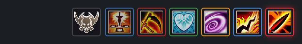
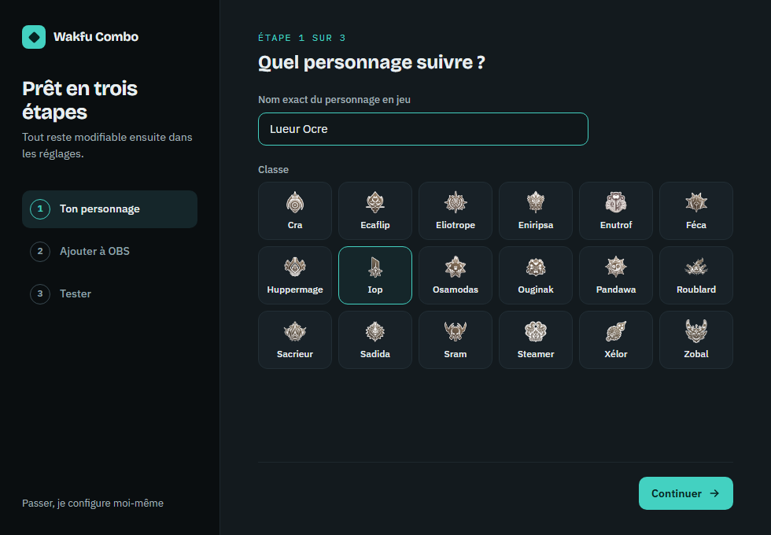
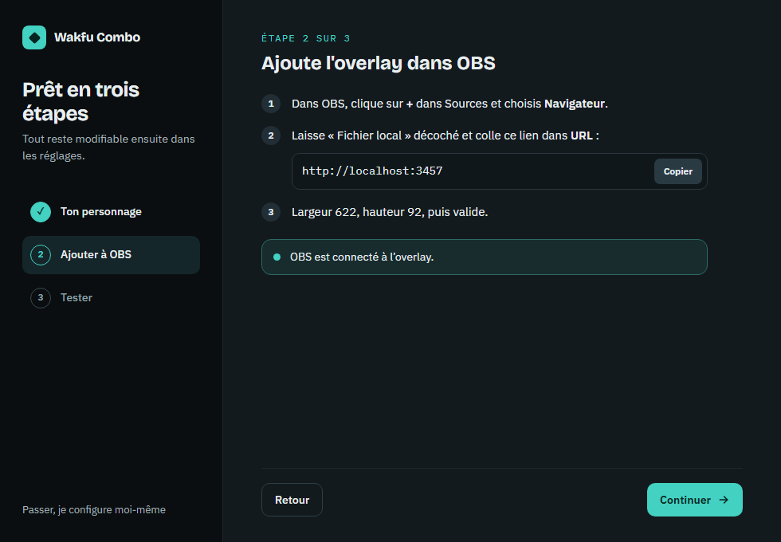
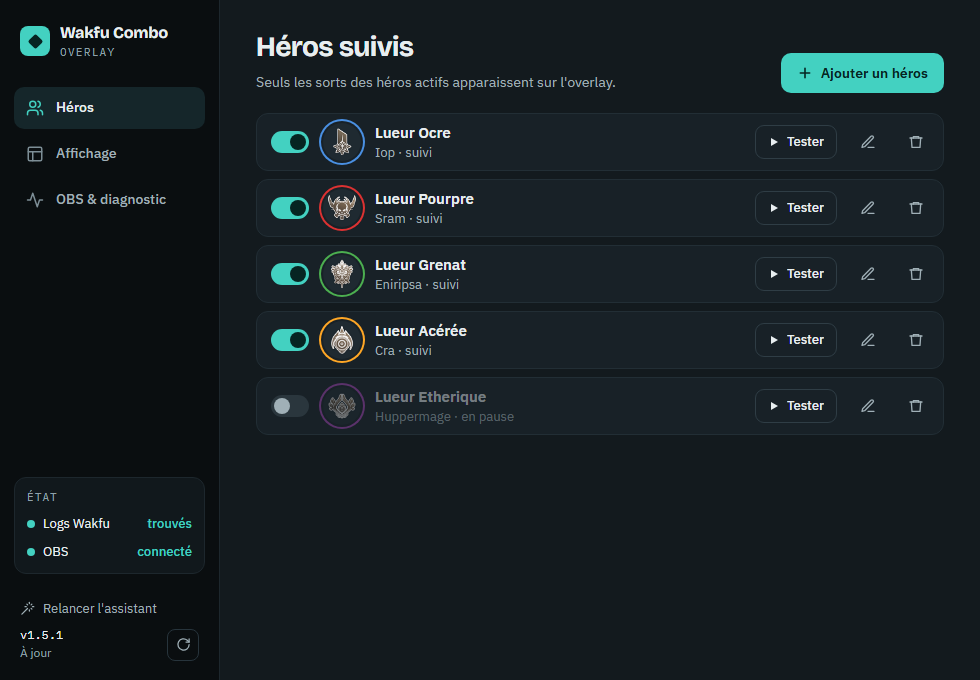
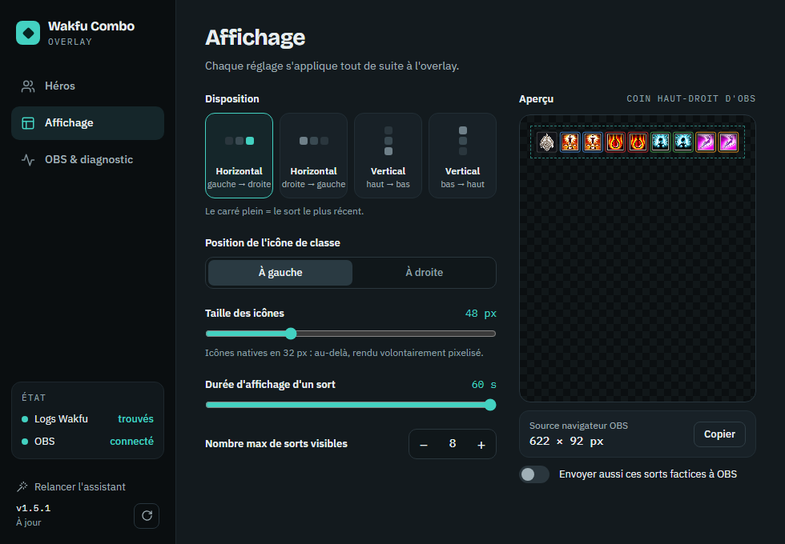
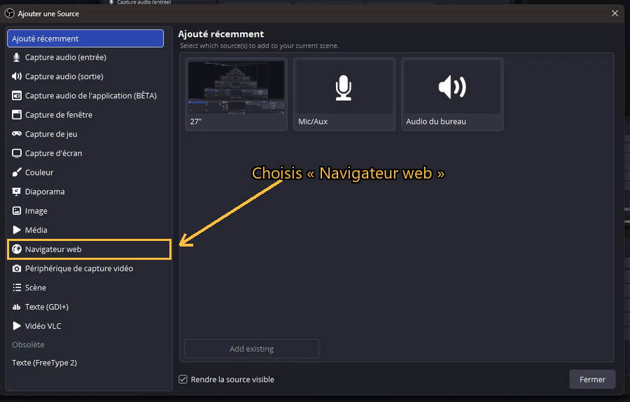
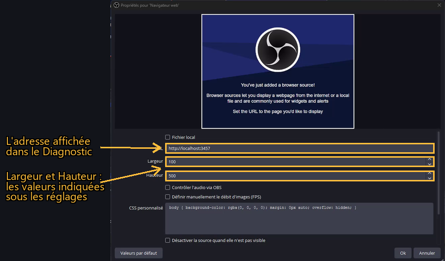
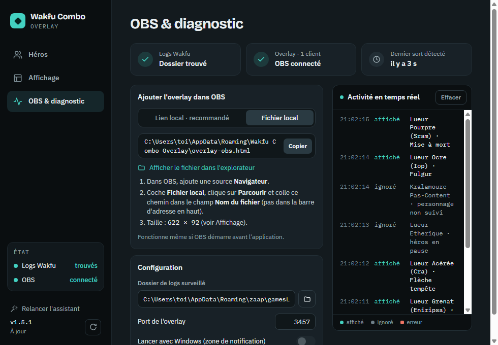
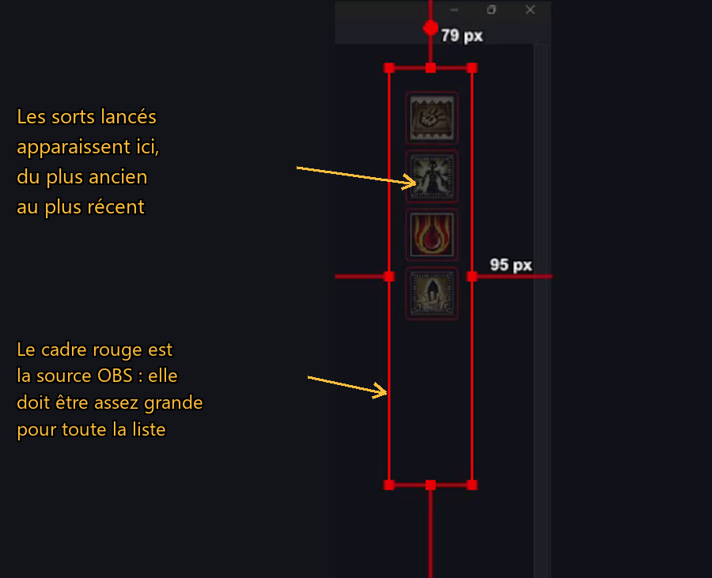
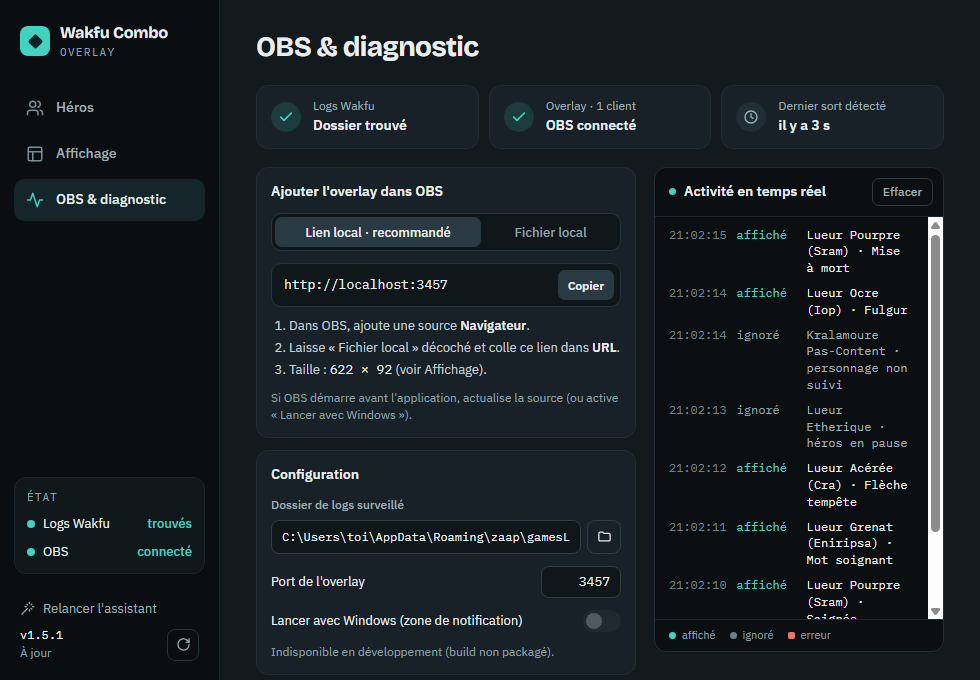

# Wakfu Combo Overlay

[](https://github.com/utruna/wakfu-combo-overlay/releases)
[](https://github.com/utruna/wakfu-combo-overlay/releases/latest)

Affiche en direct sur ton stream les sorts lancés par tes personnages Wakfu, sous forme d'icônes qui défilent dans OBS.



L'application lit les logs de combat du client Wakfu en temps réel. Elle ne garde que les sorts de tes personnages (les autres joueurs et les mobs sont ignorés) et les envoie à une page web transparente que tu ajoutes comme **Source Navigateur** dans OBS.

**[⬇ Télécharger la dernière version](https://github.com/utruna/wakfu-combo-overlay/releases/latest)** (Windows)

---

## Sommaire

- [Installation et premier lancement](#installation-et-premier-lancement)
- [Gérer tes héros](#gérer-tes-héros)
- [Régler l'affichage](#régler-laffichage)
- [Configurer OBS](#configurer-obs)
- [Vérifier que tout tourne](#vérifier-que-tout-tourne)
- [Dépannage](#dépannage)
- [Développement](#développement)

---

## Installation et premier lancement

1. Télécharge `Wakfu-Combo-Overlay-Setup-X.Y.Z.exe` depuis la [dernière release](https://github.com/utruna/wakfu-combo-overlay/releases/latest) et lance-le.
2. Windows SmartScreen peut afficher un avertissement, parce que l'installeur n'est pas signé : clique sur **Informations complémentaires** → **Exécuter quand même**.

Au premier lancement, un **assistant en trois étapes** te guide :



1. **Ton personnage** : saisis son **nom exact en jeu** et choisis sa **classe**.
2. **Ajouter à OBS** : l'assistant te donne le lien à coller et la taille de la source, puis t'indique quand OBS est bien connecté.
3. **Tester** : envoie un sort factice et vérifie qu'il apparaît dans ta scène OBS.



Tu peux passer l'assistant et tout configurer à la main. Tu peux aussi le relancer plus tard avec **Relancer l'assistant**, en bas de la barre latérale.

L'appli vit ensuite dans la **zone de notification Windows** (souvent rangée derrière la flèche `^` à côté de l'horloge). Fermer la fenêtre ne quitte **pas** l'appli : le suivi continue en arrière-plan pendant le stream. Pour la fermer complètement : clic droit sur l'icône → **Quitter**.

---

## Gérer tes héros



- **Ajouter un héros** : nom exact en jeu, classe et couleur. Le nom sert à le reconnaître dans les logs : avec une faute de frappe, il ne sera jamais détecté. La classe sert à choisir la bonne icône quand plusieurs classes ont un sort du même nom (ex. « Rafale » chez Iop et chez Cra). La couleur est celle de la bordure autour de ses icônes.
- **Interrupteur** : met un héros en pause sans le supprimer. Ses sorts sont alors ignorés.
- **Tester** : envoie un faux sort de ce héros à l'overlay, pour vérifier l'affichage sans lancer de combat.
- **Crayon** : modifier le nom, la classe ou la couleur. **Corbeille** : supprimer le héros (tu peux annuler juste après).

Tout est enregistré immédiatement, il n'y a pas de bouton « Enregistrer ».

---

## Régler l'affichage



Chaque réglage s'applique tout de suite à l'overlay, et l'**aperçu** à droite montre le résultat en direct :

- **Disposition** : horizontale ou verticale, avec le sens d'apparition des nouveaux sorts.
- **Position de l'icône de classe** : le logo de la classe du dernier sort affiché se place à gauche ou à droite de la liste. Il disparaît quand plus aucun sort n'est à l'écran.
- **Taille des icônes** : de 16 à 128 px. Les icônes du jeu font 32 px : au-delà, elles sont agrandies en pixel art net, sans flou.
- **Durée d'affichage d'un sort** : de 1 à 60 s (6 s par défaut).
- **Nombre max de sorts visibles** : quand la limite est atteinte, le plus ancien disparaît.
- **Envoyer aussi ces sorts factices à OBS** : affiche les sorts de l'aperçu dans OBS, pour positionner la source précisément dans ta scène.

Sous l'aperçu, la carte **Source navigateur OBS** indique la taille exacte à donner à la source dans OBS (bouton **Copier**). Elle dépend de la disposition, de la taille des icônes et du nombre max de sorts. Pour 8 sorts visibles :

| Taille icône | Horizontale (L × H) | Verticale (L × H) |
|---|---|---|
| 32 px | 478 × 76 | 128 × 426 |
| 48 px | 622 × 92 | 160 × 554 |
| 64 px | 766 × 108 | 192 × 682 |
| 96 px | 1054 × 140 | 256 × 938 |
| 128 px | 1342 × 172 | 320 × 1194 |

> **Piège classique** : si la source OBS est plus petite que la taille indiquée, une partie des sorts sort du cadre. L'overlay garde alors ce qui tient à l'écran, en priorité les plus récents.

---

## Configurer OBS

La page **OBS & diagnostic** de l'appli rappelle toutes les étapes.



1. Dans la liste **Sources** de ta scène : **+** → **Navigateur**.
2. Renseigne l'adresse de l'overlay, avec l'une des deux méthodes ci-dessous.
3. **Largeur** / **Hauteur** : les valeurs indiquées par la page Affichage.
4. Place la source **au-dessus** de ta capture de jeu dans la liste des sources. La page a un fond transparent : elle se superpose directement au jeu.



**Méthode 1 — Lien local (recommandé)** : laisse « Fichier local » décoché et colle `http://localhost:3457` dans **URL**. Le lien exact est affiché dans l'appli, avec un bouton **Copier**. L'appli doit être lancée avant OBS, sinon la source reste vide tant que tu ne l'actualises pas. Pour éviter ça, active **Lancer avec Windows**.

**Méthode 2 — Fichier local** : coche **Fichier local**, clique sur **Parcourir** et colle le chemin de `overlay-obs.html` dans le champ **Nom du fichier** de la fenêtre qui s'ouvre (pas dans la barre d'adresse en haut). Ce chemin est affiché dans l'onglet **Fichier local** de la page OBS & diagnostic, avec un bouton **Copier**. Cette page attend que l'appli soit lancée, puis ouvre l'overlay toute seule : ça marche même si OBS démarre en premier.



Pour tester, clique sur **Tester** en face d'un héros : son icône doit apparaître aussitôt dans l'aperçu OBS, sans lancer le stream ni l'enregistrement.



---

## Vérifier que tout tourne



- **Logs Wakfu** : « Dossier trouvé » signifie que l'appli surveille le bon dossier. Sinon, corrige le chemin dans **Configuration** (bouton dossier pour parcourir).
- **Overlay** : nombre de sources connectées. À zéro, OBS n'est pas connecté à la page (mauvaise adresse, ou source pas encore chargée).
- **Dernier sort détecté** : le dernier sort envoyé à l'overlay.
- **Activité en temps réel** : chaque sort lu dans les logs et ce qu'il est devenu : *affiché*, *ignoré* (héros en pause, autre joueur, mob) ou *erreur*. C'est l'outil à regarder en premier quand un sort n'apparaît pas.

Le bloc **État** de la barre latérale résume tout ça en permanence. La carte **Configuration** permet aussi de changer le **port** de l'overlay et d'activer **Lancer avec Windows** (l'appli démarre alors directement dans la zone de notification).

### Mises à jour

L'appli installée vérifie toute seule s'il existe une nouvelle version quelques secondes après son lancement. Si oui, elle te demande avant de télécharger quoi que ce soit. Pour relancer la vérification à la main : bouton ↻ à côté du numéro de version (en bas de la barre latérale), ou **Vérifier les mises à jour** dans le menu de l'icône de notification.

---

## Dépannage

**Rien ne s'affiche dans OBS**
- Regarde le compteur de sources connectées dans **OBS & diagnostic**. À zéro, OBS n'est pas connecté à la page : vérifie l'adresse.
- Vérifie l'ordre des sources dans OBS : la Source Navigateur doit être au-dessus de la capture de jeu.
- **OBS lancé avant l'appli** : avec le lien `http://localhost:…`, la source affiche une page d'erreur et ne réessaie jamais toute seule. Actualise la source, passe à la méthode **Fichier local**, ou active **Lancer avec Windows**.
- Une page qui vient de se charger reste vide jusqu'au prochain sort, c'est normal : les sorts déjà expirés ne sont pas réaffichés. Utilise **Tester** pour forcer un premier affichage.

**Un sort est détecté (visible dans l'activité) mais n'apparaît pas**
- Vérifie que le héros est actif (interrupteur allumé) et que son nom correspond exactement au nom en jeu.
- Vérifie que le sort a une icône dans `data/spellIcons.json`.

**Seuls les premiers sorts apparaissent**
- La source OBS est plus petite que la liste. Donne-lui la taille indiquée dans la page Affichage, ou réduis la taille des icônes ou le nombre max de sorts.

**Le dossier de logs est introuvable**
- Wakfu n'a peut-être jamais été lancé sur cette machine, ou il est installé ailleurs que via Zaap. Indique le bon dossier dans **Configuration**. Par défaut : `%APPDATA%\zaap\gamesLogs\wakfu\logs`.

**« address already in use » au lancement**
- Une autre application utilise déjà le port 3457 : change le port dans **Configuration**, puis mets à jour l'adresse dans OBS.

**Les sorts des invocations (créature Osamodas, poupée Sadida…) n'apparaissent pas**
- Limitation connue. Les invocations lancent leurs sorts sous leur propre nom (ex. « Chafer Elite lance le sort Sabre d'élite »), pas sous celui du personnage : elles sont donc classées *ignoré* comme un joueur inconnu. Pour les afficher, il manque deux choses :
  1. Rattacher l'invocation à son héros. Le mécanisme existe dans le code (`characterAliases` dans `src/characterMatcher.js`) mais il n'est pas exposé dans l'interface.
  2. Récupérer les icônes de ces sorts : ils ne figurent pas sur les pages classe de l'encyclopédie que scrape `tools/scrape_spell_icons.js`.

**« Cannot find latest.yml in the latest release artifacts » lors d'une recherche de mise à jour**
- La dernière release publiée ne contient pas `latest.yml`, le plus souvent parce que la nouvelle release est encore en brouillon (draft). Publie-la, puis relance la vérification. Pour voir ce que voit l'updater :

```bash
curl -s https://github.com/utruna/wakfu-combo-overlay/releases.atom | grep -o 'releases/tag/[^"]*'
```

---

## Développement

### Prérequis

- Node.js 18+
- Windows (le chemin des logs Wakfu et la surveillance de fichiers sont spécifiques à Windows)
- Wakfu installé via le launcher Zaap

### Lancer en dev

```bash
npm install
npm run electron:dev
```

```bash
npm test      # tests unitaires (node --test)
npm run lint  # ESLint
```

### Générer un installeur

```bash
npm run dist
```

Produit un installeur Windows (NSIS) dans `dist/`.

### Publier une release

Le workflow `.github/workflows/release.yml` build l'installeur sur un runner Windows et le publie en **GitHub Release** : pas besoin de commiter l'exe.

1. Monte la version dans `package.json` (`npm version patch` / `minor` / `major`) et pousse le commit.
2. Sur GitHub : **Actions** → **Build & Release (Windows)** → **Run workflow**.
3. Une fois le workflow terminé, la release `vX.Y.Z` apparaît dans **Releases** avec l'installeur `.exe` et `latest.yml`.

Le workflow échoue explicitement si la version a déjà une release publiée : il faut alors monter `version` et relancer. Sinon, il crée et pousse le tag `vX.Y.Z`, crée la release en brouillon (ou réutilise le brouillon d'un essai raté), y envoie les fichiers avec electron-builder, puis la publie. Le brouillon créé à l'avance évite que plusieurs publieurs créent chacun leur propre release.

`latest.yml` est le fichier que lit l'auto-updater pour connaître la dernière version, et l'updater ne voit que les releases **publiées** (le flux public `releases.atom` n'affiche pas les brouillons).

### Fichiers et dossiers

- `electron/main.js` : process principal (zone de notification, fenêtre, lien entre le lecteur de logs et l'overlay, auto-update)
- `electron/preload.js` : pont IPC exposé à la fenêtre de réglages
- `electron/settings/` : fenêtre de réglages et assistant de premier lancement
- `electron/overlay/` : page servie à OBS
- `src/wakfuCombatLogReader.js` : lecture incrémentale de `wakfu.log`
- `src/characterMatcher.js` : tri entre héros suivis et autres joueurs ou mobs
- `src/settingsStore.js` : enregistrement des réglages
- `src/obsLoaderPage.js` : génère `overlay-obs.html` (méthode Fichier local)
- `overlay/server.js` : petit serveur HTTP/SSE
- `data/spellIcons.json` : table nom de sort → icône, générée par `tools/scrape_spell_icons.js`
- `assets/icons/` : icônes des sorts (par classe) et logos de classe (`classes/`)

Les réglages sont enregistrés dans `%APPDATA%\Wakfu Combo Overlay\settings.json`. Ce dossier est séparé de l'installation : les réglages survivent à une réinstallation.

### Régénérer les icônes de sorts

```bash
node tools/scrape_spell_icons.js
```

Le script récupère le nom officiel et l'icône de chaque sort des 18 classes depuis l'encyclopédie Wakfu. Il les range dans `assets/icons/<classe>/<id>.png` et `data/spellIcons.json`, une table par classe (`{classe: {nomDuSort: {iconId, icon}}}`) pour qu'un sort partagé comme « Rafale » n'écrase pas celui de l'autre classe. Il récupère aussi le logo de chaque classe dans `assets/icons/classes/<classe>.png`. Le script est volontairement lent : un premier lancement prend plusieurs dizaines de minutes, un relancement ne télécharge que ce qui manque.

`assets/icons/` et `data/spellIcons.json` sont versionnés et embarqués dans l'installeur. Relancer le scraper ne sert qu'après une mise à jour du jeu (nouveaux sorts, icônes retouchées).

Deux cas sont gérés à la main parce que l'encyclopédie officielle ne les documente pas :

- **Les 10 cartes de l'Écaflip** : noms et ids figés dans `ECAFLIP_CARDS`, repris de stratfu.fr et vérifiés un par un en combat (apostrophes droites comme en jeu).
- **Les 3 sorts communs** (Maîtrise d'Armes, Charme de Masse, Os à Moelle) : ids figés dans `COMMON_QUEST_SPELLS`, rangés sous la pseudo-classe `"commun"`. La recherche d'icône (`findSpellIcon` dans `electron/main.js`) se rabat dessus pour n'importe quel héros.

Les images sont toujours téléchargées depuis Ankama. Les icônes restent la propriété d'Ankama et sont redistribuées ici dans le cadre d'un outil communautaire non commercial.

### Régénérer les captures d'écran

```bash
npx electron tools/capture_screenshots.js
```

Ce script refait `doc/app-*.png` et `doc/overlay-rendu.png` sur l'appli réelle, lancée avec un profil de démo isolé (héros fictifs, faux `wakfu.log`, port 3499). Depuis un terminal VS Code, retire d'abord la variable `ELECTRON_RUN_AS_NODE`, sinon Electron démarre comme un simple Node. Les captures `doc/obs-*.png` sont faites à la main dans OBS.
